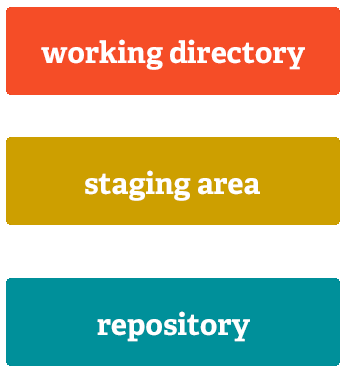
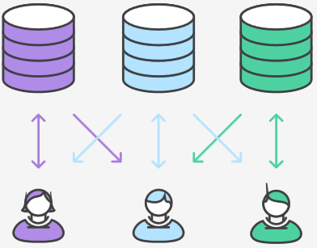
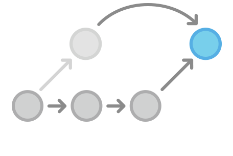

# Software Development in Teams

# Introduction

## About Me

> - GSoC Student
> - GSoC Mentor/Admin
> - Founder coala
> - Freelancer
> - Founder GitMate

## Communication

https://gitter.im/coala-analyzer/coala/workshops

[100 seconds!](http://www.tickcounter.com/100seconds)

## Who is Who

- Name
- GitHub Nick
- Idea
- Logo
- Idea? Implementor? Both?
- Expectations?

[5 Minutes Prep!](http://www.tickcounter.com/5minutes)

[3 Minutes Each (next one line up)](http://www.tickcounter.com/3minutes)

You'll be invited.

# What do we do?

## What do we do?

I want you to be able to do:

- write software in a team without friction.
- raise your code quality and stability over time!
- scale your project (or rather not).

## What do we do?

- Today:
    - Learn Git! A bit.
    - Contribute to coala.
- Tomorrow:
    - Good and Scalable Software
    - Work on your projects!

# What is Git?

## What is Git?


## What is Git?


## What is a Commit?

```
commit b134cef5d89c07ca189edf10bc6b0195b8d5f7f5
Author: Lasse Schuirmann <lasse.schuirmann@gmail.com>
Date:   Mon Mar 14 11:04:17 2016 +0100

    Makefile: Use 16:9 format

    We'll probably use that kind of projector plus it fits better
    for my images.
```

## What is a Commit?

```diff
diff --git a/presentation/Makefile b/presentation/Makefile
index f0c41e9..093b844 100644
--- a/presentation/Makefile
+++ b/presentation/Makefile
@@ -10,5 +10,5 @@ continuous: default

 _compile:
        @echo -n "Compiling markdown to pdf..."
-       @pandoc $(PRES) -s -o $(TARGET)
+       @pandoc $(PRES) -s -o $(TARGET) -V classoption:aspectratio=169
        @echo " DONE."
```

## Excercise!

- Install Git
- Say Good Bye to your GUI
- Open the Git Shell
- `git config --global core.editor notepad`
- Create a directory; `cd` into it
- `git init`
- Create a file with some content
- Help your neighbour

[20 Minutes](http://www.tickcounter.com/20minutes)

## Staging

{height=55%}

## A Repository is Nothing...

{height=55%}

## Excercise!

- Stage: `git add <your file>`; `git status`
- Commit: `git commit`, enter message, close editor; `git show`
- Change your file
- Autostage and Commit: `git commit -a`

[15 Minutes](http://www.tickcounter.com/15minutes)

{height=35%} {height=35%}

## Git(Hub|Lab)


## Task Management


## Grab an Issue!

http://tinyurl.com/coala-new

The first one to comment gets it! Do not comment if you see there's a comment
already. There are enough for everybody.

[5 Minutes](http://www.tickcounter.com/5minutes)

## Fork!

{height=50%}

## Fork'n'Clone

Go to the repository of your issue. It'll be *one of*:

- https://github.com/coala-analyzer/coala/
- https://github.com/coala-analyzer/coala-bears/

And fork it:

- Do not watch it. Many emails...
- Star it (optional :))
- Click on `Fork`

## Clone

- `git clone <url-of-your-fork-shown-by-github>`
- `cd coala`
- `git remote add upstream <url-of-original-shown-by-github>`

## Do It!

- Solve the issue!
- Do a commit.
- `git push` it up
- On GitHub make a Pull Request
- Help your neighbour

# Lunch Break (Be Back at 14:30h)

## Code Reviews

What is it good for?

[10 Minutes](http://www.tickcounter.com/10minutes)

## Code Reviews

- Quality
- **Ensure** Understandability!
- Learning from each other.
- Can be partly automated!
- Iterate! More issues, higher difficulty and naturally more reviews.

## Commit Messages

```
setup: Install .coafile via package_data

When installing the .coafile to
distutils.sysconfig.get_python_lib, we ignore that this
is not the installation directory in every case. Thus
it is easier, more reliable and platform independent to
let distutils install it by itself.

Fixes https://github.com/coala-analyzer/coala/issues/269
```

## Iterate

- Change
- `git commit -a --amend` - replace your previous commit
- `git push --force`

## Rebase



## Rebase (Excercise)

- `git fetch upstream`
- `git rebase -i upstream/master`

[15 Minutes](http://www.tickcounter.com/15minutes)

{height=40%}

# Break (Be Back at 16:20h)

# Fast Forward!

## Challenge:

Everyone who submits a reasonable PR for an issue out of
<http://tinyurl.com/coala-low> by tomorrow get's a bar of chocolate!

Support and reviews will be provided at least until 0 am local time on

- https://gitter.im/coala-analyzer/coala/workshops
- https://gitter.im/coala-analyzer/coala

# Questions

# Closing

## Closing

- Meet **tomorrow at 1 pm**
- We'll speak about some cool stuff!
- We'll have a hackevening with pizza.
- I'm here right now as long as needed to answer all questions and hack with
  you!

# Software Dev. in Awesome Teams

## Welcome & Chocolate Showcase!

**Chocolate!**

## Teambuilding

- You've got ideas!

[4 Volunteers: 7.5 Minutes](http://www.tickcounter.com/7minutes30seconds)

[5 Volunteers: 6 Minutes](http://www.tickcounter.com/6minutes)

[6 Volunteers: 5 Minutes](http://www.tickcounter.com/5minutes)

[7 Volunteers: 4 and a bit Minutes](http://www.tickcounter.com/4minutes10seconds)

[8 Volunteers: 3.75 Minutes](http://www.tickcounter.com/3minutes45seconds)

[9 Volunteers: 3.33 Minutes](http://www.tickcounter.com/3minutes20seconds)

## Teambuilding

- Vote
- Winners into Edges of the Room, max two people follow

## Goals and Non Goals

- Set primary, possibly secondary goals.
- Set **non goals**.

[10 Minutes](http://www.tickcounter.com/10minutes)

## Mockups: CLI

```
$ coala
/home/lasse/prog/coala/setup.py
|   2| ••••
|    | [NORMAL] SpaceConsistencyBear:
|    | Line contains trailing whitespaces.
|    | The following actions are applicable:
|    |  0: Apply no further actions.
|    |  1: Open the affected file(s) in an editor.
|    |  2: Apply the patch automatically.
|    |  3: Print a diff of the patch.
```

## Mockups: GUI

https://wiki.gnome.org/Design/Apps/Mail

Use the power of Inkscape!

## Mockups: API

```python
@bear(depends_on=ClangASTBear)
def ClangAnalysisBear(ClangASTBearResults: list()):
    for diagnostic in ClangASTBearResults:
        yield Result.from_clang_diagnostic(diagnostic)
```

## Make a Mockup

- Project Leader: Split up in Three Scenarios
- Members: Take Scenarios (Leader takes leftover)

[5 Minutes](http://www.tickcounter.com/5minutes)

## Make a Mockup

Draw mockup!

[10 Minutes](http://www.tickcounter.com/10minutes)

## Make a Mockup

- Rotate counterclockwise
- Check and annotate mockup

[10 Minutes](http://www.tickcounter.com/10minutes)

## Prototyping

- Try out technical decisions and assumptions
- Perform the most dirty hacks if needed
- Give it people to test
- Throw it away :)

## Usability Testing

Define Task:

- Not suggestive!
- Give goals, not paths

## Usability Testing

Define test instructions for your scenario.

> Run our program.

> Check your code using coala.

# Break (Be Back at 15:45)

## Mockup & Test Presentation

[2 Minutes Each](http://www.tickcounter.com/2minutes)

## Working in a Team

Discussion:

- Scrum
- Feature Based vs. Time Based Release
- Alternatives?

## Code Quality

- *Quality* should *raise* over time!
- Because *complexity will raise* over time.

Once you're out of prototype:

- Review code!
- Write atomic commits
- Write tests

## Code Quality Automation

> Things go wrong when humans are involved.

Wise words from *Lasse*

- Use static code analysis! (E.g. coala)
- Enforce it on Pull Requests. (E.g. GitMate)
- Run tests automatically. (E.g. Travis CI, GitLab CI)
- Check test coverage automatically. (E.g. codecov.io)

## Documentation Testing

```python
def add(*args):
   """
   Adds the given numbers while ignoring None's.

   >>> add(2, None, 6)
   8

   :param args: The numbers to add.
   :return:     The sum of the given numbers.
   """
   return sum((arg or 0) for arg in args)
```

## Scalability

Don't scale.

If a team grows, split it up.

*Do not attempt to manage a large team.*

## FAQ

- Server in the Cloud?

> Do **not** attempt AWS.

- What Makes Good Software?

> “Always code as if the person who ends up maintaining your code will be a
  violent psychopath who knows where you live.”

## FAQ

- How Much Should I Test?

> For Production? Everything.

- How do I Motivate People?

> Go the way ahead. You're crazy. Become a visionary.

# Closing

# Questions?

# Internationalization and Localization

## Internationalization

```python
from gettext import _

things_to_buy = (_('a Ford Prefect') + ' '
                 _('and') + ' ' +
                 ', '.join([_('mice'), _('towel')]))

print(_("Let's buy {}.".format(things_to_buy))
```

## Localization

- Translators shouldn't need to use git!
- Translators should have a possibility to file bugs for wrong i18n!

# Releasing

## Milestones vs. Schedule

Feature based releases?

## Tracing Changes

Updating `CHANGELOG`s sucks!

- Track a wiki page.
- Maintainer updates on release.
- Annotate commit messages.

## Backporting

Fix bugs in old releases.

- Cherry Pick

## Automation

- Release
- Prerelease
- Deployment
